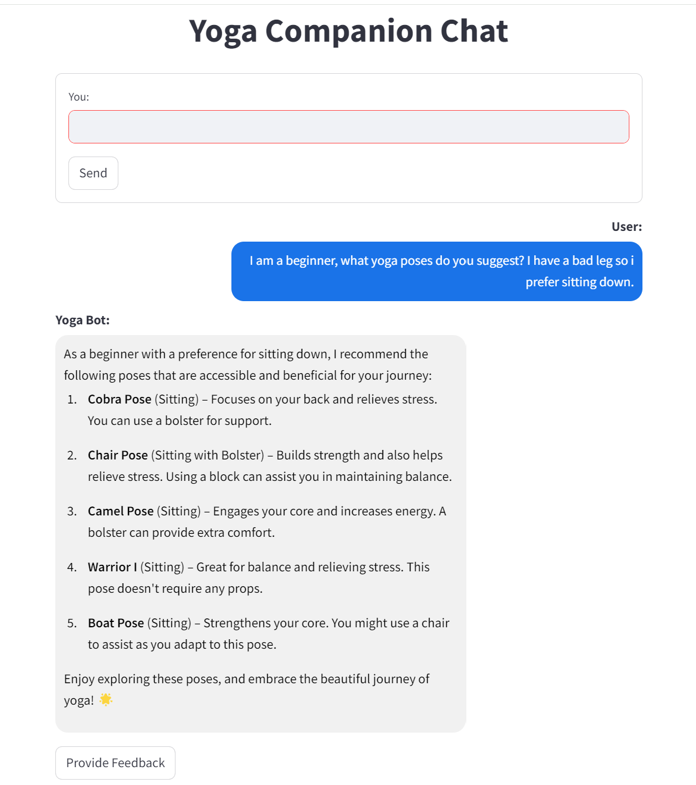
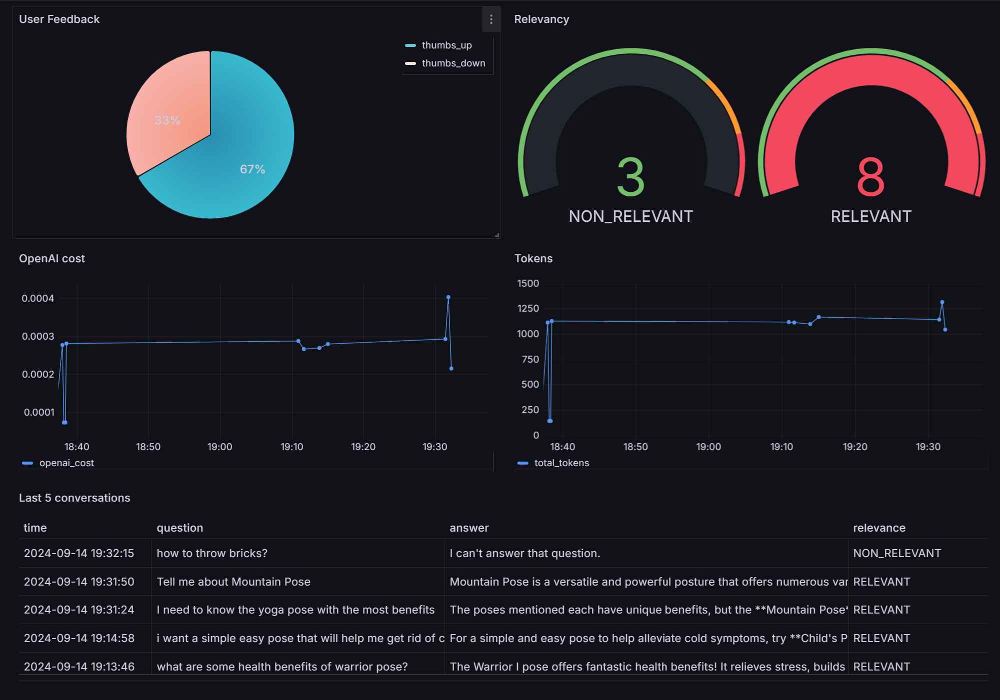

# Yoga Companion RAG Application

#### Maintaining a regular yoga practice can be challenging, especially for beginners. Studios can be intimidating, and personal instructors aren't always accessible or affordable. The AI Yoga Assistant provides a conversational AI that helps users choose yoga poses, find modifications, and create personalized sequences, making yoga more approachable and manageable for practitioners of all levels.


### Techologies
* [Minsearch](https://github.com/alexeygrigorev/minsearch) - for full text search 
* GPT 4o-Mini as an LLM
* Flask as the API interface endpoint
* Streamlit for creating the user interface
* Grafana for monitoring 
* PostgreSQL as the backend database

### Project Evaluation
* Both a knowledge base and an LLM are used in the RAG flow
* Multiple retrieval approaches are evaluated, and the best one is used
* Multiple RAG approaches are evaluated, and the best one is used
* Streamlit frontend and Flask backend API
* Automated ingestion with a Python script
* User feedback is collected and there's a dashboard
* All required service is containerized and in docker-compose
* Code is reproducible, Instructions are clear, the dataset is accessible, its easy to run the code and it works

### Video Instructions
- [Project Setup](https://www.loom.com/share/d7814589f590430b806f93baa8dcb496?sid=488c1063-374d-4407-aef4-7bd4000f3366)
- [Running Application using Docker](https://www.loom.com/share/e0342fc82c744a7eafcfd8ced9abe2c5?sid=e118b70a-c100-4bb7-898f-97811f5f98c2)
- [Monitoring using Grafana](https://www.loom.com/share/92ce956787c24a7e87c42e118318d472?sid=51c35be7-d3ab-4ae1-ae28-be7fe1ec9fa8)

### Project Setup

**IMPORTANT:** Open the [.env](.env) file in the root directory and replace `YOUR-KEY-HERE` in `OPENAI_API_KEY` variable with your own OpenAI key. Also, all the terminal commands assumes you are at the root directory.

After providing your API key run the following commands one by one to setup the project.

```bash
pipenv install
pipenv install --dev
docker-compose up -d postgres
pipenv shell
cd yoga-companion
export POSTGRES_HOST=localhost
python db_prep.py
exit
docker-compose down postgres
```

If you see the following message without errors then you are done setting up the project.

`Initializing database...`

### Running Application using Docker
First, start the required services by running the following command.

```bash
docker-compose up
```

If all the services are running successfully visit [http://localhost:8501](http://localhost:8501) to start the application interface.

A working application should look like this. 


### Monitoring using Grafana
All the configuration files are in the [`grafana`](grafana) folder

To import the dashboard run the following commands one by one but make sure `docker-compose` is running beforehand.

```bash
pipenv shell
cd grafana
python init.py
exit
```

Then visit [http://localhost:3000/](http://localhost:3000/) and login using the following information.<br>
username: `admin`<br>
password: `admin`

After first login it will ask you to change the password which you may do or you can just press the skip button if you dont want to do that. After successfully logging in click on `Dashboards` on the left sidebar and then click on `Yoga Companion` from the list.

A working monitoring dashboard should look like this.


### Code
The code for the application is in the [yoga-companion](yoga-companion) folder:

* [app.py](yoga-companion/app.py) - the Flask API, the main entrypoint to the application
* [rag.py](yoga-companion/rag.py) - the main RAG logic for building the retrieving the data and building the prompt
* [ingest.py](yoga-companion/ingest.py) - loading the data into the knowledge base
* [minsearch.py](yoga-companion/minsearch.py) - an in-memory search engine
* [db.py](yoga-companion/db.py) - the logic for logging the requests and responses to postgres
* [db_prep.py](yoga-companion/db_prep.py) - the script for initializing the database
* [test.py](yoga-companion/test.py) - select a random question for testing
* [streamlit_app.py](yoga-companion/streamlit_app.py) - the logic for generating the user interface

### Dataset

The dataset used in this project contains information about various yoga poses, including:

- Pose Name: The name of the yoga pose (e.g., Downward Dog, Eagle Pose, Warrior I)
- Type of Practice: The style of yoga the pose is commonly used in (e.g., Yin, Vinyasa, Ashtanga, Restorative, Power)
- Variation: Any specific variation of the pose (e.g., Twisted, Reclining, With Block, No Variation)
- Position: The general body position for the pose (e.g., Standing, Lying Down, Mixed, Sitting)
- Difficulty: The level of difficulty for the pose (e.g., Beginner, Intermediate, Advanced)
- Props Required: Any equipment needed for the pose (e.g., Chair, Block, Strap, Blanket, Not Required)
- Body Focus: The primary area of the body targeted by the pose (e.g., Flexibility, Balance, Core, Strength, Back)
- Benefits: The main benefits associated with practicing the pose (e.g., Builds strength, Improves balance, Relieves stress, Increases energy)
- Synonyms: Alternative names for the pose
- Instructions: Step-by-step guidance on how to perform the pose correctly
- Context: Suggestions for when to use the pose in a yoga sequence or routine

The [dataset](data/yoga_poses.csv) was generated using LLM in CSV format and contains 150 records. It serves as the foundation for understanding various yoga poses, their characteristics and their applications in different yoga practices.

### Experiments
For experiments, we use Jupyter notebooks. They are in the notebooks folder.


We have the following notebooks:

* [`rag-test.ipynb`](notebooks/rag-test.ipynb): The RAG flow and evaluating the system.
* [`eval-data-gen.ipynb`](notebooks/eval-data-gen.ipynb): Generating the ground truth dataset for retrieval evaluation.

### Retrieval Evaluation
The basic approach - using minsearch without any boosting - gave the following metrics:
* Hit rate: 86.9%
* MRR: 52.5%

The improved version (with tuned boosting):
* Hit rate: 96% (+9.1%)
* MRR: 58.7% (+6.2%)

The best boosting parameters:
```python
boost = {
    'pose_name': 1.77295549488741,
    'type_of_practice': 1.7646875012919119,
    'variation': 0.39512555991207565,
    'position': 2.0631444783206327,
    'difficulty': 1.4963276491573105,
    'props_required': 0.2392338995716874,
    'body_focus': 1.0491245848640036,
    'benefits': 1.7364406525582377,
    'synonyms': 2.5022067788712308,
    'instructions': 0.49163944386874336,
    'context': 2.1715194651138052
}
```

### RAG flow evaluation
We used the LLM-as-a-Judge metric to evaluate the quality of our RAG flow.

For gpt-4o-mini, in a sample with 200 records, we had:
* 132 (66%) RELEVANT
* 63 (31.5%) PARTLY_RELEVANT
* 5 (2.5%) NON_RELEVANT

We also tested gpt-4o:
* 98 (49%) RELEVANT
* 80 (40%) PARTLY_RELEVANT
* 22 (11%) NON_RELEVANT

The difference is significant, so we opted for gpt-4o-mini due to efficiency and cost ratio.

### Background
Here we provide background on some technologies used

### Flask
It's a web application framework for Python: we can easily create an endpoint for asking questions and use web clients (like curl or requests) for communicating with it.

For more information, [click here](https://flask.palletsprojects.com/en/3.0.x/)

### Streamlit 
Streamlit is an open-source Python framework that allows you to create and share beautiful, interactive web applications for machine learning and data science projects with minimal code.

For more information, [click here](https://docs.streamlit.io/)
